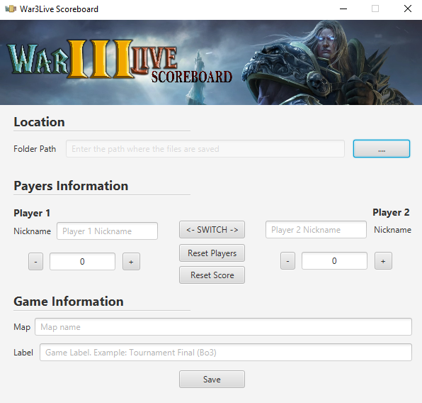
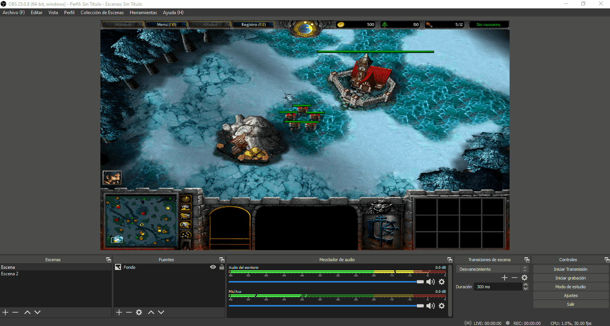

# War3Live Scoreboard
It's a Scoreboard for Obs Studio. This Scoreboard is intended for the Warcraft 3 video game. However, it can be used in other types of video games using the user name and score function.

## Requirements
- Languages: 

- Libraries: JavaFX

## Screenshots

  

## Usage
1. [Download the lastest version release](https://github.com/KorKux1/war3live-scoreboard/releases).
2. Extract it somewhere.
3. Execute start.bat
4. Fill in the data you need and click on save button.
5. In OBS, add the Score images and Map name. Add an image source and upload the images.

6. In Obs, add the Text Sources. Select Local File and select the .txt files on the file's folder that you selected.

7. You can change the data and click on the save button, the obs will see the changes and reflect them.

## Setup (Developer Mode)
1. Clone the Repository.

> git clone https://github.com/KorKux1/war3live-scoreboard.git

2. Import The project in your favorite IDE.

3. Run the project.

## Known bugs
- There is an error exporting the project as a JavaFX project and generating the .exe
> Java FX Packager: Can't build artifact - fx:deploy is not available in this JDK

## License
AGPL-3.0

---
⌨️ with the ❤️ by KorKux 😊

